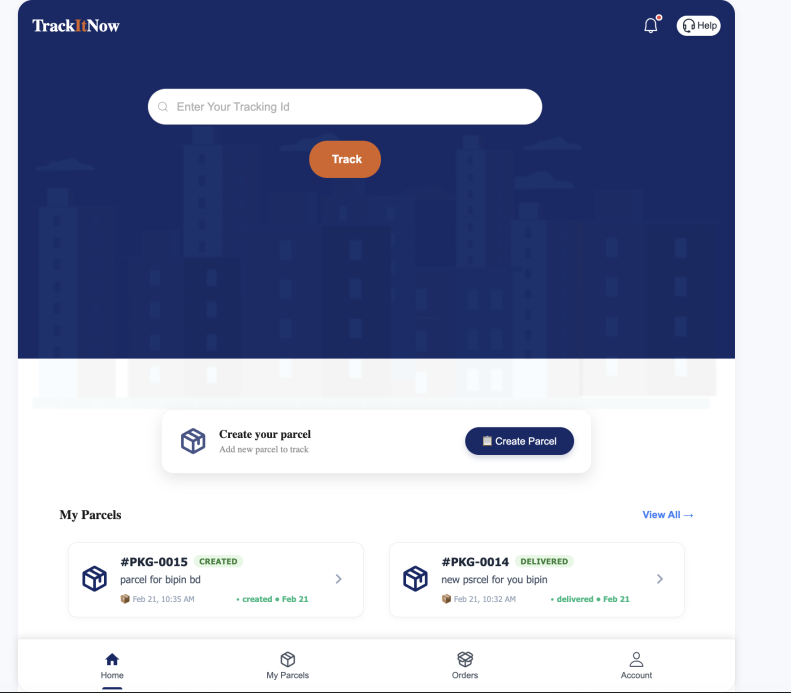
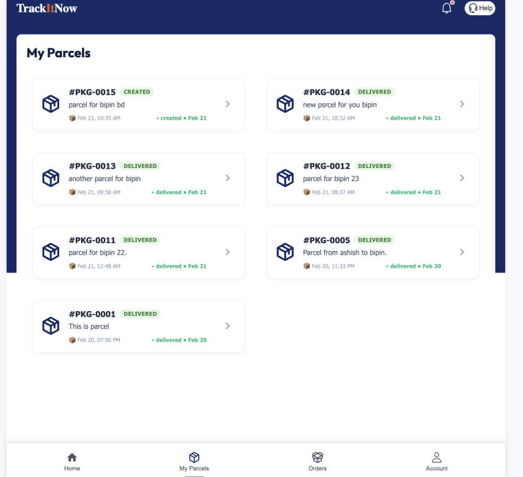
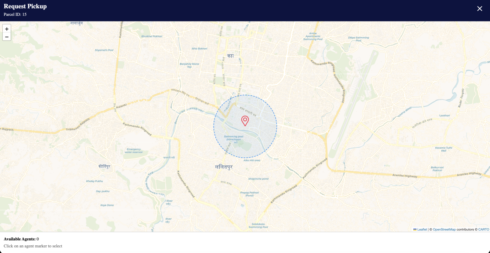
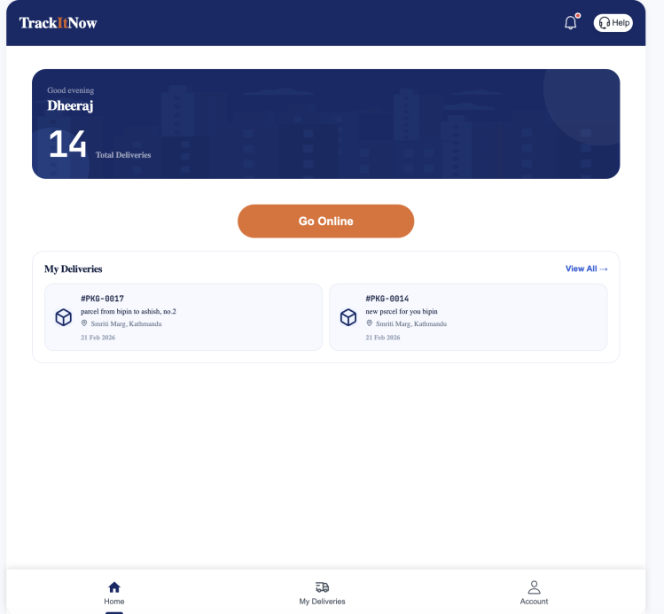

images/
# 🚚 Track-It-Now – Real-Time Parcel Tracking System

TrackItNow is a real-time parcel delivery and tracking system built using React, WebSockets, and OpenStreetMap.  
It allows customers to send parcels and track delivery agents live on the map.

---

## 🌟 Features

- 🔐 User Authentication (Customer & Agent)
- 📦 Parcel Request & Acceptance System
- 🗺️ Live Location Tracking using Leaflet + OSM
- 🔔 Real-Time Notifications
- 📍 Reverse Geocoding (Place name from lat/lng)
- 📡 WebSocket-based Live Updates
- 📱 Responsive UI

---


### Frontend Tech Stack
- React
- React Router
- React-icons
- WebSockets
- React Leaflet
- Axios
- WebSocket
---

## 📸 Application Screenshots
### 📍 Track It Now (Live Tracking)


---

### 👤 Customer Home


---
### 📦 Customer Parcels


---

### 🔎 Agent Search


---

### 🏠 Agent Home

---

##  How To Run The Project

### 1️. Clone the repository

```bash
git clone https://github.com/Ashish-411/Track-It-Now.git

### 2. Frontend Setup
cd frontend
npm install
npm run dev
